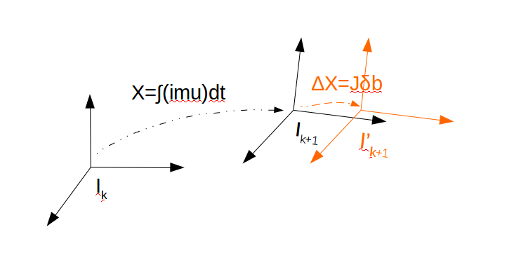

# 理论相关

&nbsp;

## Reference

1. VINS-Mono: A Robust and Versatile Monocular Visual-Inertial State Estimator.
2. Quaternion Kinematics for Error-State KF.

&nbsp;

## 预积分的推导

预积分是VINS-Mono中十分重要的一个步骤，主要涉及的是IMU的运动方程，下面对这部分进行一个简单的推导，主要使用的是ESKF中的方法，采用简单的欧拉法在连续时域下进行推导。

---

### ESKF

这部分详细可以参照参考【2】，这里做一个记录，ESKF的主要精髓在于分析的是error-state，并且获得的是error-state的状态更新方程，但是对于优化问题，优化的变量其实并不是error-state，而是state，那为什么会有这个理论的诞生，这里先**埋个坑（坑1）**，后面会解释。

1. ESKF有两个变量，一个是normal-state $X$，一个是truth-state $X_t$，两者的关系如下：
   $$
   \mathbf{X_t}=\left[\begin{array}{c}
   \mathbf{p_t} \\
   \mathbf{v_t} \\
   \mathbf{q_t} \\
   \mathbf{a}_{bt} \\
   \boldsymbol{\omega}_{bt}
   \end{array}\right]=
   \left[\begin{array}{c}
   \mathbf{p}+\delta{p} \\
   \mathbf{v}+\delta{v} \\
   \mathbf{q}\otimes\delta{q} \\
   \mathbf{a}_{b}+\delta{a_b} \\
   \boldsymbol{\omega}_{b}+\delta{\omega_b}
   \end{array}\right]=\mathbf{X}\boxplus\mathbf{\delta{X}} \tag{1}
   $$
   
2. 进一步，通过对两边求微分得到：
   $$
   \begin{aligned}
   \dot{\delta \mathbf{p}} &=\delta \mathbf{v} \\
   \dot{\delta \mathbf{v}} &=-\mathbf{R}\left[\mathbf{a}_{m}-\mathbf{a}_{b}\right]_{\times} \delta \boldsymbol{\theta}-\mathbf{R} \delta \mathbf{a}_{b}-\mathbf{R} \mathbf{a}_{n} \\
   \dot{\delta \boldsymbol{\theta}} &=-\left[\boldsymbol{\omega}_{m}-\boldsymbol{\omega}_{b}\right]_{\times} \delta \boldsymbol{\theta}-\delta \boldsymbol{\omega}_{b}-\boldsymbol{\omega}_{n} \\
   \dot{\delta \mathbf{a}_{b}} &=\mathbf{a}_{w} \\
   \delta \dot{\boldsymbol{\omega}}_{b} &=\boldsymbol{\omega}_{w}
   \end{aligned} \tag{2}
   $$

3. 对公式2进行离散化
   $$
   \begin{aligned}
   \delta \mathbf{p} & \leftarrow \delta \mathbf{p}+\delta \mathbf{v} \Delta t \\
   \delta \mathbf{v} & \leftarrow \delta \mathbf{v}+\left(-\mathbf{R}\left[\mathbf{a}_{m}-\mathbf{a}_{b}\right]_{\times} \delta \boldsymbol{\theta}-\mathbf{R} \delta \mathbf{a}_{b}\right) \Delta t+\mathbf{v}_{\mathbf{i}} \\
   \delta \boldsymbol{\theta} & \leftarrow I-\left[\boldsymbol{\omega}_{m}-\boldsymbol{\omega}_{b}\right]_{\times} \Delta t \delta \boldsymbol{\theta}-\delta \boldsymbol{\omega}_{b} \Delta t+\boldsymbol{\theta}_{\mathbf{i}} \\
   \delta \mathbf{a}_{b} & \leftarrow \delta \mathbf{a}_{b}+\mathbf{a}_{\mathbf{i}} \\
   \delta \boldsymbol{\omega}_{b} & \leftarrow \delta \boldsymbol{\omega}_{b}+\boldsymbol{\omega}_{\mathbf{i}} 
   \end{aligned} \tag{3}
   $$
   其中：

   - $R$表示从机体系到世界坐标系的旋转；
   - $a_m$表示IMU的测量减去重力加速度的值；

4. 将公式3写作矩阵形式，得到kalman滤波的预测阶段：
   $$
   \begin{array}{l}
   \hat{\delta} \boldsymbol{\mathbf { x }} \leftarrow \mathbf{F}_{\mathbf{x}}\left(\mathbf{x}, \mathbf{u}_{m}\right) \cdot \hat{\boldsymbol{\delta}} \mathbf{x} \\
   \mathbf{P} \leftarrow \mathbf{F}_{\mathbf{x}} \mathbf{P} \mathbf{F}_{\mathbf{x}}^{\top}+\mathbf{F}_{\mathbf{i}} \mathbf{Q}_{\mathbf{i}} \mathbf{F}_{\mathbf{i}}^{\top}
   \end{array} \tag{4}
   $$
   其中：

   - $$
     \mathbf{F}_{\mathbf{x}}=\left.\frac{\partial f}{\partial \delta \mathbf{x}}\right|_{\mathbf{x}, \mathbf{u}_{m}}=\left[\begin{array}{ccccc}
     \mathbf{I} & \mathbf{I} \Delta t & 0 & 0 & 0 & 0 \\
     0 & \mathbf{I} & -\mathbf{R}\left[\mathbf{a}_{m}-\mathbf{a}_{b}\right]_{\times} \Delta t & -\mathbf{R} \Delta t & 0 & \mathbf{I} \Delta t \\
     0 & 0 & I-\left[\boldsymbol{\omega}_{m}-\boldsymbol{\omega}_{b}\right]_{\times} \Delta t & 0 & -\mathbf{I} \Delta t & 0 \\
     0 & 0 & 0 & \mathbf{I} & 0 & 0 \\
     0 & 0 & 0 & 0 & \mathbf{I} & 0 \\
     0 & 0 & 0 & 0 & 0 & \mathbf{I}
     \end{array}\right]
     $$

   - $$
     \mathbf{F}_{\mathbf{i}}=\left.\frac{\partial f}{\partial \mathbf{i}}\right|_{\mathbf{x}, \mathbf{u}_{m}}=\left[\begin{array}{cccc}
     0 & 0 & 0 & 0 \\
     \mathbf{I} & 0 & 0 & 0 \\
     0 & \mathbf{I} & 0 & 0 \\
     0 & 0 & \mathbf{I} & 0 \\
     0 & 0 & 0 & \mathbf{I} \\
     0 & 0 & 0 & 0
     \end{array}\right]
     $$

   - $$
     \mathbf{Q}_{\mathbf{i}}=\left[\begin{array}{cccc}
     \mathbf{V}_{\mathbf{i}} & 0 & 0 & 0 \\
     0 & \mathbf{\Theta}_{\mathbf{i}} & 0 & 0 \\
     0 & 0 & \mathbf{A}_{\mathbf{i}} & 0 \\
     0 & 0 & 0 & \Omega_{\mathbf{i}}
     \end{array}\right]
     $$

   

---

### 积分与预积分

积分比较简单，拿到IMU的数据进行常规的积分操作，就可以得到两节点之间的相对位姿和速度。这里祭出IMU的运动模型：
$$
\begin{cases}
\dot{p}=v \\
\dot{v}=R_{i_k}^{i_0}(a_m-b_a-n_a) \\
\dot{q}=q\otimes q\{w_m-b_w-n_w\} \\
\dot{b_a}=w_a \\
\dot{b_w}=w_w
\end{cases} \tag{5}
$$
可以看到，在进行积分的时候，公式中不仅使用了各个时刻的IMU测量值，而且用到零偏值，因此当零偏值变化的时候，整个微分数值就产生了变化，于是最后的相对状态值就会产生变化，此时一种方法是将修改后的零偏值带入到积分过程中得到新的相对位姿和速度。

重新带入的方法是可行的，但是这样会比较浪费时间和算力。于是预积分的方法就提出来了。

承接上面的ESKF，把正常的积分过程看做是normal-state，**这部分积分仅与这段时间的IMU测量值以及零偏bias有关，与其他量都无关**，当零偏bias被优化之后，此时并不用修改normal-state的量，而是认为变化的这部分在error-state中，下面有个简略的示意图：

图中X表示使用IMU数据进行积分的过程，IMU认为在这段时间内，坐标系的变化为从$I_k$到$I_{k+1}$，而当状态变量进行了优化，零偏变化$\delta b$时，积分过程需要加上$\Delta X$，即假如零偏变化了$\delta b$，那么IMU认为坐标系的变化应该到$I^{'}_{k+1}$，所以剩下就是求解上图中的黄色部分的变化了，这里采用一阶近似来表示这个变化，推导如下：
$$
\begin{cases}
p_t=p_{int}+\frac{\partial{p}}{\partial{b}}\delta{b}=p_{int}+\frac{p+\delta{p}-p}{\delta{b}}\delta{b}=p_{int}+\frac{\delta{p}}{\delta{b}}\delta{b} \\
v_t=v_{int}+\frac{\part{v}}{\part{b}}\delta{b}=v_{int}+\frac{v+\delta{v}-v}{\delta{b}}\delta{b}=v_{int}+\frac{\delta{v}}{\delta{b}}\delta{b} \\
q_t=q_{int}\otimes\begin{bmatrix}1\\ \frac{1}{2}\frac{\part{\theta}}{\part{b}}\delta{b} \end{bmatrix}=q_{int}\otimes\begin{bmatrix}1\\ \frac{1}{2}\frac{\part{\theta}}{\part{b}}\delta{b} \end{bmatrix}=q_{int}\otimes\begin{bmatrix}1\\ \frac{1}{2}\frac{\theta+\delta{\theta}-\theta}{\delta{b}}\delta{b} \end{bmatrix}=q_{int}\otimes\begin{bmatrix}1\\ \frac{1}{2}\frac{\delta{\theta}}{\delta{b}}\delta{b} \end{bmatrix}
\end{cases}  \tag{6}
$$

其中需要说明的几个点为：

- 偏导这里采用了求导的原始定义；
- 相对姿态使用四元数进行表示，这里使用旋转向量来表示误差量，这样的好处就是能在$\R^3$空间上直接进行向量的加减操作，十分方便；

所以看到，公式6中的所有偏导数都变作了导数，其中$\frac{\delta{\theta}}{\delta{b}},\frac{\delta{p}}{\delta{b}}, \frac{\delta{v}}{\delta{b}}$都可以在预积分公式3中找到。

所以为什么要用ESKF也就很明显了，同时使用ESKF进行error-state状态的更新还有另一个好处就是能够得到这次观测的协方差，如何得到呢？其实也很简单，使用协方差的原始定义就好啦，这里以位置为例：
$$
P_p=E((p_t-p_{int})^T(p_t-p_{int}))=E(\delta{p}^T\delta{p})=P_{\delta{p}} \tag{7}
$$

----

### VINS中的中点法（mid-point）

在VINS-Mono的代码中，作者使用的是中点法进行的，其实和参考2中的中点法不太一样，这里的中点法使用的是两端点的平均，下面进行简单的推导，先给出离散时间下的迭代步骤：
$$
\begin{cases}

\end{cases}
$$

#### 旋转的error-state

$$

$$

## visual-inertial alignment

